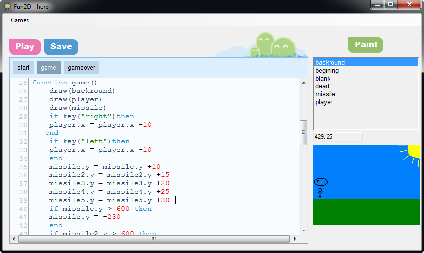

# Fun2D

Fun2D is a game-maker that I created for a class of 6th grade students at Jane
Long Middle School, for an after-school apprenticeship program organized by
[Citizen Schools](http://www.citizenschools.org/).  The students used it to
learn how to create a game over a 10-week period in the Fall Semester of 2010.



A key feature of Fun2D is its ability to run on Windows without installation,
necessitated by the computer permission restrictions at the school and the
absence of a computer lab staff.

During the 2010 program, each student was given a USB drive containing Fun2D.  This
allowed them to plug the USB drive into any computer (home or school lab) and
run it straight from the USB drive without installation.  The USB Drive also
acted as saved storage for their game they were creating.  All the students
were given the USB drives after the program ended so they could keep their
games and continue developing on their home computers.

## Objective

My objective was to teach kids how to make a game by allowing them to
paint characters and scenery that they could put into a simple game.
I wanted them to learn how to move their painted characters around the screen
using simple code, and to transition to a game over screen when their
character hit some falling objects.

Overall, my goal was to teach simple programming concepts in a simple interface
that empowered them to bring their paintings to life.

## How it works

1. Open "Fun2D.exe", making sure that the "common" and "games" folders are in the
same directory.
2. Create a new game, and give it a name.
3. Click "Paint" to create pictures in MSPaint.  Saved images can be seen on the right side of the window.
4. Write code for the game on the left side of the window.  
5. Click "Play" to test your game.

[Watch this video demonstration for more details.](http://www.youtube.com/watch?v=Q2ngpuTfUnQ)

## Tech Details

Fun2D is an editor + game framework.  The editor is a C# .NET WinForms
application that shows a code editor ([SyntaxBox](http://code.google.com/p/alsing/wiki/SyntaxBox)) as well as a
paint editor (MSPaint).  The game framework is a heavily simplified layer over
[Love2D](https://love2d.org/).

Running the game from the editor causes everything in the code editor to be
saved as "game.lua". This file, along with the custom Lua files found in the
"common" directory, are then fed into the Love2D executable to run the game.

## Creating an image

You can create and preview images from the editor:

1. Click "Paint" to open MSPaint.
2. Treat the light grey as the transparent color.
3. Notice that the boundary of the image constitutes the full size of the game screen.
4. Resize the image boundary if you want to draw a smaller character.
5. Save the image as some "name".
6. Exit MSPaint.
7. To preview your image in the editor, click the image name on the right panel.
8. To get the coordinates of a position on the image, mouse over the preview image.
9. To copy the coordinates at a desired position, simply click.

## Writing Code

The code in this editor will just consist of a "start" function and a list of other
"scene" functions, each one corresponding to the scene's _main loop_.

All functions are listed at the top of the editor as clickable buttons. You can
click one of them to go to their respective position in the code.  The buttons
will auto-highlight when viewing a specific function in code to let you know
where you are.

### 1. Creating the start function

The code must have a `start` function, which is executed when the game first starts.
This is where you must create your image objects, set their initial positions, and start
the first "scene".

```lua
function start()

	-- create image objects (using the names of the images in your editor)
	background = image("background")
	player = image("player")
	enemy = image("enemy")
	dead = image("dead")

    -- initialize player position
	player.x = 10
	player.y = 200

	-- initialize enemy position
	enemy.x = 400
	enemy.y = 200
	enemy.dx = -1

	-- start first scene
	scene(game)
end
```

### 2. Creating the game scene function

Each scene is represented by a function that is executed every frame.  Here is
the game scene.  It moves the enemy back and forth, moves the player if the
keys are pressed, ends the scene if the player collides with the enemy, and
draws the appropriate images.

```lua
function game()

	-- move the enemy back and forth
	enemy.x = enemy.x + enemy.dx
	if enemy.x < 0 then
		enemy.dx = 1
	end
	if enemy.x > 200 then
		enemy.dx = -1
	end

	-- allow the player to move if keys are pressed
	if key("left") then
		player.x = player.x - 1
	end
	if key("right") then
	    player.x = player.x + 1
	end

	-- go to "gameover" scene if you touch enemy
	if collide(player, enemy) then
		scene(gameover)
	end

	-- draw everything
	draw(background)
	draw(enemy)
	draw(player)

end
```

### 3. Creating the gameover scene function

The gameover scene simply draws the "dead" image and restarts the game when you
press enter:

```lua
function gameover()

	-- restart game if player to presses enter
	if key("enter") then

		-- reset player and enemy positions
		player.x = 10
		enemy.x = 400

		-- restart game
		scene(game)

	end

	-- draw everything
	draw(dead)

end
```

## Conclusion and Results

Classroom management was the biggest problem in the 6th grade classroom, which hindered
the teaching and I had to leave most of the class behind so that the students who were
paying attention would have a completed game.

The students seemed to grasp the program flow and simple if-then instructions for the game.
The concepts took a lot of repetition for them to sink in, but they demonstrated a basic
understanding.  Starting every day with a worksheet that they could fill out during
the short lecture on the day's topic, and then moving to the computer lab to build their
game seemed to work well.

All of the completed student games are in the "games" folder of this repository.

[You can read my teaching journal here for more details about the experience](journal)


